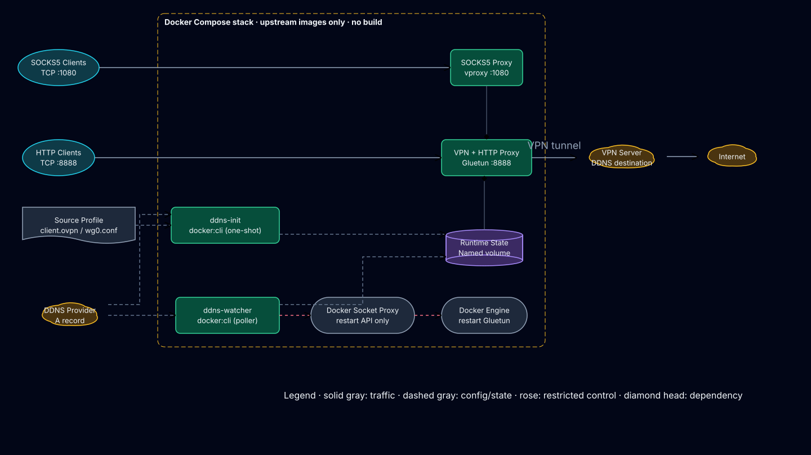
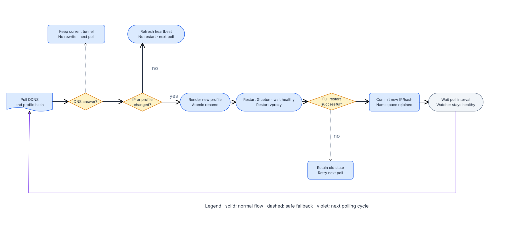

# 架構與設計決策

## 問題定義

Gluetun 是本專案的 VPN runtime。它已經提供 OpenVPN、WireGuard、kill switch、DNS、
連線健康檢查、自動修復與 HTTP proxy，不應重寫這些功能。

但 Gluetun 的 custom provider 有一項刻意的限制：啟動前的 firewall 不允許先做可能
洩漏的 DNS 查詢，因此 OpenVPN `remote` 與 WireGuard `Endpoint` 都必須先是 IP。
v3.41.1 的 parser／settings source 也直接以 IP connection 建模：

- [Custom OpenVPN configuration file](https://github.com/qdm12/gluetun-wiki/blob/main/setup/openvpn-configuration-file.md)
- [Gluetun v3.41.1 `extractRemote`](https://github.com/qdm12/gluetun/blob/v3.41.1/internal/openvpn/extract/extract.go)
- [Gluetun v3.41.1 WireGuard config source](https://github.com/qdm12/gluetun/blob/v3.41.1/internal/configuration/sources/files/wireguard.go)

這和 DDNS server 的需求衝突：來源設定必須保留 hostname，且 IP 改變後必須讓
Gluetun 重新讀取新的 resolved profile。本專案的責任只限於這個 adapter lifecycle。

## 系統全貌



### 元件與邊界

| Service | 上游 image | Lifecycle | 單一責任 |
| --- | --- | --- | --- |
| `ddns-init` | `docker:29.6.1-cli-alpine3.24` | one-shot | 啟動前驗證、解析、首次原子 render |
| `gluetun` | `qmcgaw/gluetun:v3.41.1` | long-running | VPN、firewall、health、HTTP proxy |
| `vproxy` | `ghcr.io/0x676e67/vproxy:v2.5.5` | long-running | SOCKS5 TCP proxy |
| `ddns-watcher` | 與 init 相同 | long-running | DNS／profile 監看與重啟協調 |
| `docker-socket-proxy` | `ghcr.io/tecnativa/docker-socket-proxy:v0.4.2` | long-running | 將 Docker API 限制為兩個精確 restart target |

沒有任何 service 使用 `build:`。`ddns-init` 與 `ddns-watcher` 掛載同一份
`scripts/ddns-openvpn.sh`，用 `init`／`watch` subcommand 分離 lifecycle，因此不需要
自有 watcher image。檔名為了既有部署相容性保留，但內容以 `VPN_TYPE` dispatch
OpenVPN／WireGuard。

## 開機時序

```text
docker compose up
       │
       ▼
  ddns-init ── validate profile + referenced files
       │       resolve all IPv4 A records
       │       render /state/runtime/vpn.conf atomically
       │       write last-ip + fingerprint
       ▼
  exits 0
       │  depends_on: service_completed_successfully
       ▼
   Gluetun ─── read resolved runtime profile
       │       build firewall + establish selected VPN tunnel
       │       expose HTTP proxy :8888
       ▼
    vproxy ─── share service:gluetun network namespace
       │       expose SOCKS5 :1080
       ▼
ddns-watcher ─ poll indefinitely
```

設定錯誤會立即讓 init 以 code `64` 結束。DNS 暫時不可用則按照
`DDNS_INIT_RETRY_SECONDS` 持續重試；這兩者刻意分開，避免把永久設定錯誤誤當成暫時
網路錯誤。

## Steady-state 與恢復流程



每輪 watcher 會取得三份證據：

1. hostname 當前所有有效 IPv4 A records；
2. 已提交的 `last-ip`；
3. source profile 與被引用檔案的 SHA-256 fingerprint。

狀態轉移如下：

| 條件 | 動作 | Tunnel 影響 |
| --- | --- | --- |
| DNS 暫時失敗 | 記錄 warning、更新 heartbeat、保留現況 | 無 |
| 舊 IP 仍在 A record 集合 | 繼續使用舊 IP | 無，避免 round-robin flap |
| IP 與 fingerprint 都相同 | 只更新 heartbeat | 無 |
| 舊 IP 消失 | render、restart Gluetun、等 healthy、restart vproxy、commit | 一次受控重連 |
| `.ovpn`、引用檔案或 `wg0.conf` 變更 | 同一套 full-stack restart | 一次受控重連 |
| health timeout 或任一 restart 失敗 | runtime profile 已安全寫入，但不 commit state | 下輪完整重試 |

### 為何不在 DNS 暫時失敗時重啟

現有 VPN session 可能仍正常；即使 DNS resolver 短暫不可用，已建立的 tunnel
通常不需要 hostname。覆寫或重啟只會將控制面的短暫故障放大成資料面的中斷。因此
watcher 採 stale-but-working 優先策略。

### 多 A record 的穩定選擇

DNS 回應順序不保證穩定。若每次取第一筆，round-robin DNS 會讓 watcher 每分鐘重啟。
選擇規則因此是：

1. 將合法 IPv4 去重、排序；
2. 若 `last-ip` 仍在集合內，繼續使用；
3. 否則選排序後第一筆。

這不會把 DNS answer order 誤判為 endpoint 變更，同時仍能在舊 IP 被移除時切換。

### 原子寫入與 commit 順序

runtime profile 和狀態檔都先用 `mktemp` 在目標目錄建立，再以 `mv` 取代。因為暫存
檔與目標檔在同一個 named volume filesystem，rename 是 atomic；Gluetun 不會看到
半份設定。

變更順序固定為：

```text
resolve → render temporary file → atomic rename → restart Gluetun
        → wait for Gluetun healthy → restart vproxy → commit last-ip + fingerprint
```

只有整條鏈成功才 commit。若 Gluetun restart、health wait 或 vproxy restart 任一步失敗，
舊的 `last-ip`／fingerprint 都不會前進，下一輪自然會再次嘗試。

### Network namespace lifecycle

`network_mode: service:gluetun` 只規定 vproxy 啟動時加入哪個 namespace，不代表 Gluetun
被單獨 restart 後 Docker 會同步重建 vproxy。watcher 因此必須在 Gluetun healthy 後明確
restart vproxy。重啟後，vproxy healthcheck 從共享 namespace 內確認：

1. SOCKS5 `:1080` 正在 listen；
2. Gluetun `:9999` health endpoint 回傳成功；
3. OpenVPN 的 `tun0` 或 WireGuard 的 `wg0` 存在；
4. `ip route get 1.1.1.1` 實際走該 VPN interface。

舊 namespace 只剩 loopback 時，後三項不可能同時成立，因此不會再誤報 healthy。
watcher 在 commit 前也會從當前 Gluetun service address 連線 `:1080`；只有 listener
確實出現在新的 Gluetun namespace，full-stack restart 才視為完成。

## Runtime 資料模型

`vpn-state` named volume 內只有衍生資料：

```text
/state/
├── ddns/
│   ├── last-ip              # 最後成功提交的 endpoint
│   ├── source.sha256        # profile + references fingerprint
│   └── watcher-heartbeat    # watcher 最近一輪 epoch seconds
└── runtime/
    └── vpn.conf             # Gluetun 實際讀取的 resolved profile／secret file
```

來源 profile、憑證與 credentials 只以 read-only bind mount 出現在 `/source`。runtime
profile 權限為 `0600`；Gluetun 對 named volume 使用 read-only mount。

`vpn-state` 可以刪除並重新產生，不需要備份。真正需要備份的是 host 上
`VPN_CONFIG_DIR` 指向的來源資料。

## OpenVPN render 契約

Renderer 將唯一啟用的：

```ovpn
remote vpn.example.com 1194 udp
```

轉成：

```ovpn
remote 203.0.113.10 1194 udp
```

其餘內容保留。下列 file directives 的相對路徑會轉為 `/source` 下的絕對路徑，且
啟動前必須可讀：

```text
ca, cert, key, tls-auth, tls-crypt, tls-crypt-v2,
crl-verify, dh, pkcs12, secret, askpass,
http-proxy-user-pass
```

Gluetun 會把 `auth-user-pass` 覆寫成 `/etc/openvpn/auth.conf`，所以該 directive 中的
file path 不納入 render／fingerprint。Profile 使用 `auth-user-pass` 時，preflight 要求
`.env` 同時提供 `OPENVPN_USER` 與 `OPENVPN_PASSWORD`。

實際 username/password 只注入 Gluetun；helper containers 僅收到兩個
`*_CONFIGURED` boolean，不持有 VPN 或 proxy credentials。相同 gate 也驗證 HTTP／
SOCKS5 credential pair，以及非 loopback bind 必須啟用 authentication。

包含 whitespace 的 quoted file path 目前會 fail-fast，避免 shell／OpenVPN parser
之間產生模糊解讀。需要時應先把檔名改成無空白形式。

## WireGuard render 契約

WireGuard source 必須剛好有一個 `[Interface]` 與一個 `[Peer]`，且包含 `PrivateKey`、
`Address`、`PublicKey` 與 hostname-based `Endpoint`：

```ini
[Interface]
PrivateKey = <client-private-key>
Address = 10.0.0.2/32

[Peer]
PublicKey = <server-public-key>
Endpoint = vpn.example.com:51820
```

Renderer 只將 endpoint 改為 `Endpoint = 203.0.113.10:51820`，其餘內容原樣保留，並以
`0600` 原子寫入 `/state/runtime/vpn.conf`。PrivateKey／PresharedKey 不進 Compose
environment；Gluetun 透過 `WIREGUARD_CONF_SECRETFILE` 讀取 named volume。

Gluetun v3.41.1 從該檔匯入 PrivateKey、Address、PresharedKey、PublicKey 與 Endpoint；
`AllowedIPs`、persistent keepalive、MTU 與 implementation 由 Compose environment 的
`WIREGUARD_*` 設定提供。即使 source 保留這些常見 wg-quick 欄位，也以 `.env` 為準。

## Proxy 資料路徑

```text
HTTP client  ── host:8888 ──► Gluetun HTTP proxy ──┐
                                                    ├─► tun0/wg0 ─► VPN server
SOCKS5 client ─ host:1080 ──► vproxy ───────────────┘
                                │
                                └─ network_mode: service:gluetun
```

port 必須 publish 在 `gluetun`，因為 vproxy 沒有自己的 network namespace。
`FIREWALL_INPUT_PORTS=1080,9999` 讓 Gluetun firewall 接受 sidecar listener，並讓同一個
internal Compose network 上的 watcher 存取 health endpoint。只有 `1080` publish 到 host；
`9999` 沒有 host port mapping。SOCKS5 只 publish TCP，因此 UDP ASSOCIATE 不在契約內。

## Docker API 安全邊界

直接把 `/var/run/docker.sock` 掛進 watcher 等同給予 host root 級能力。本架構改成：

```text
ddns-watcher
   │ DOCKER_HOST=tcp://docker-socket-proxy:2375
   ▼
internal docker-api network
   ▼
docker-socket-proxy
   └── mounted restart-only HAProxy policy
         ├── GET/HEAD /_ping
         ├── POST /containers/${GLUETUN_CONTAINER_NAME}/restart
         ├── POST /containers/${VPROXY_CONTAINER_NAME}/restart
         └── deny every other method and path
```

只有 socket proxy service 掛載 host socket，`docker-api` 是 `internal: true` 且沒有
published port。專案掛載自己的 `docker/socket-proxy-haproxy.cfg.tmpl`，啟動時驗證
container 名稱並在 tmpfs render 精確 policy，把 target 綁定
`GLUETUN_CONTAINER_NAME` 與 `VPROXY_CONTAINER_NAME`，不使用上游
`CONTAINERS`／`ALLOW_RESTARTS` coarse-grained flags；上游的 restart 群組也包含 stop
與 kill，而 `CONTAINERS + POST` 會開放其他 containers POST endpoints。精確、anchored
path allowlist 避免這兩種權限擴張。

policy template 只會作為 HAProxy config template 載入，不會被執行。因 restrictive
umask 可能讓 Git checkout 的 bind-mounted 檔案成為 `0700`，socket proxy 與 helper
一樣在 `cap_drop: ALL` 後只加回 `DAC_READ_SEARCH`；它看得到的 host path 仍僅有
Docker socket 與 read-only policy file。socket proxy 仍屬敏感控制面，不應讓其他
container 加入該 network。

## Container hardening

| 控制 | 套用範圍 |
| --- | --- |
| `no-new-privileges:true` | 所有 service |
| `cap_drop: [ALL]` | init、watcher、vproxy、socket proxy |
| `DAC_READ_SEARCH` | init／watcher 讀 source；socket proxy 讀 policy bind mount |
| `read_only: true` | init、watcher、vproxy、socket proxy |
| 專用 tmpfs | 需要暫存空間的 hardened services |
| `NET_ADMIN` | 只有 Gluetun |
| `/dev/net/tun` | 只有 Gluetun |
| loopback port binding | HTTP／SOCKS5 預設 |
| image version pinning | 所有 service |
| rotating `json-file` logs | 所有 service，預設 `10m × 3` |

Gluetun 是唯一需要 `NET_ADMIN` 與 TUN device 的 service。Bind-mount readers 額外保留
最小的 `DAC_READ_SEARCH`，原因是 container UID 0 在 drop `DAC_OVERRIDE` 後無法讀取
host UID 擁有的 `0600`／`0700` profile、key 或 policy；可見範圍仍受各自 mount 限制。
helper script 使用 POSIX sh，完全依賴 stock Docker CLI image 已有的 `awk`、`getent`、
`nslookup`、`sha256sum` 與 Docker client，不在啟動時 `apk add`。

## Health model

- **Gluetun**：使用上游 image healthcheck；`HEALTH_RESTART_VPN=on` 會在 tunnel 失效
  時內部重啟 VPN。
- **vproxy**：每 10 秒以 `nc -z 127.0.0.1 1080` 確認 listener。
- **docker-socket-proxy**：透過預設允許的 `/_ping` 確認 HAProxy 與 daemon socket。
- **ddns-watcher**：每輪更新 heartbeat；healthcheck 容許約三個 polling interval 加
  30 秒。DNS 查詢失敗不等於 watcher process 不健康。
- **ddns-init**：one-shot service，成功後保持 exited (0) 是正常狀態。

## 已排除的替代方案

### 只使用 Gluetun hostname

OpenVPN 本身支援 hostname 與 `resolv-retry infinite`，但 Gluetun custom provider 在
OpenVPN 啟動前就會拒絕非 IP `remote`；WireGuard settings 也要求 endpoint IP，因此
兩種模式都不可行。

### 自建 watcher image

會增加 Dockerfile、registry、multi-arch build、SBOM、簽署與發布 lifecycle，且目標
主機受制於自有 image 是否成功發布。stock Docker CLI 已具備全部必要工具，掛載小型
POSIX adapter 更符合純 Compose 目標。

### 啟動時安裝 package

`alpine` 加 `apk add` 雖然也是 Compose，但每次啟動依賴 package mirror，增加啟動
時間與供應鏈變數。固定 Docker CLI image 不需 runtime install。

### watcher 直接掛 Docker socket

實作最短但權限過大。加入成熟的 Docker Socket Proxy 是一個可接受的額外 service，
因為它將控制面能力明確縮小並可自動驗證。

## 明確限制

- 只支援 IPv4 A record；不解析 AAAA。
- OpenVPN 只支援一個 active `remote`；WireGuard 只支援一個 `[Peer]`／`Endpoint`。
  專案選擇 fail-fast，避免看似有 failover、實際被忽略。
- hostname 解析與 profile 檢查週期最低 10 秒。
- DDNS 改變會造成一次 container restart 與短暫 tunnel 中斷；不嘗試 hot reload。
- proxy credentials 以環境變數傳入，可被具有 Docker inspect 權限的人看到。
- socket proxy 降低但無法完全消除 Docker socket 風險。
